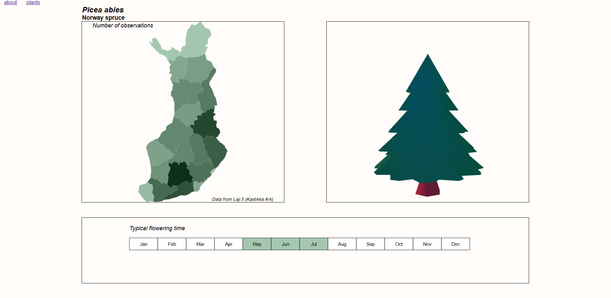

# Herbarium (in 3D) (very early build)

Just little something I have been working on for fun to combine programming and 3d modeling. I have always had a soft spot for old botanical illustrations (any scientific illustrations, truly) and creating a little herbarium that mimics older herbariums/plant atlases is a fun little side project.

## What needs doing

Currently there is no proper way for looking through the different plants, this functionality will be added in due time.

Early build is still a bit rough around the edges:

## 3D

3D models are being created in Blender. Then exported as GLTF and loaded using React Three Fiber (R3F).

## Observation data

What I really want here is proper distribution maps. This is the trickier part, however, as collecting necessary data for distribution maps is currently difficult. I have made an example file for European spruce (*Picea abies*), but have not yet gathered this information for other species.

As a current solution the visualisation is about the number of observations. This can skew the data towards the more populous areas such as Uusimaa region.

## Additional information

Data is currently fetched by hand.

## Tech stack

React 
React Three Fiber 
D3.js 

## Sources

Species data is from Lajitietokeskus: Suomen Lajitietokeskus/FinBIF. http://tun.fi/HBF.98925 (haettu 30.12.2024). 
3D model(s) by me